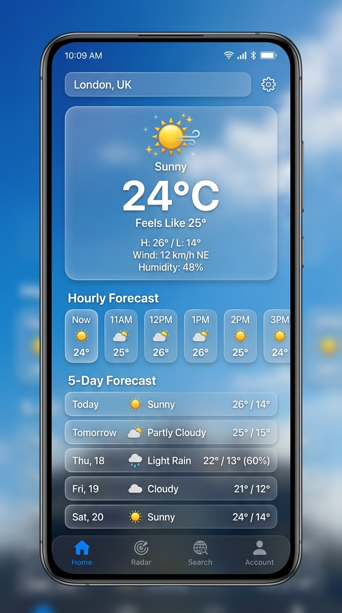
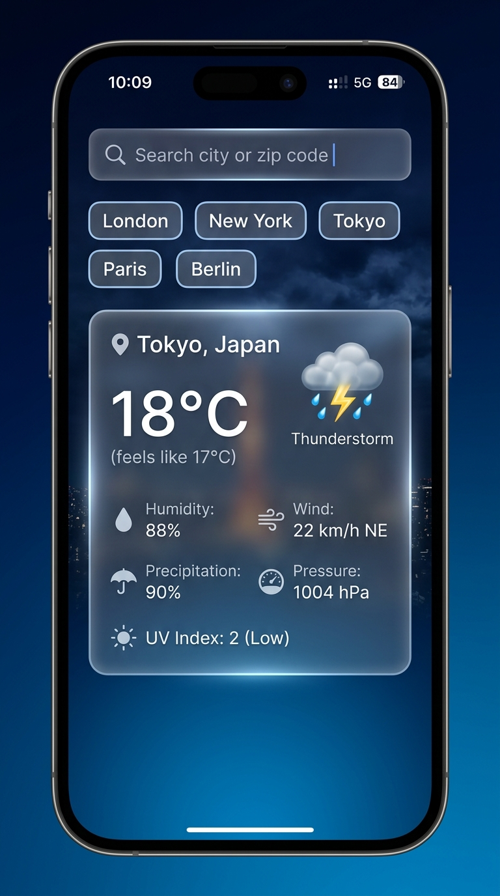

# 🌤️ Modern Glassmorphic Weather App

A feature-rich, high-performance Flutter weather application built using **Clean Architecture**, **BLoC Pattern**, **Glassmorphic UI Design System**, and **Dynamic Atmospheric Gradients**.


---

## 📱 Screenshots

<p align="center">
  
  &nbsp;&nbsp;&nbsp;&nbsp;
  
</p>

---

## ✨ Features

- 🌈 **Dynamic Atmospheric Backgrounds**: Background gradients dynamically shift based on real-time weather conditions (Clear Sky, Clouds, Rain, Thunderstorm, Snow) and light/dark theme preference.
- 💎 **Glassmorphic UI System**: Translucent frosted glass containers (`BackdropFilter`) with subtle glowing borders and soft drop shadows.
- 🎨 **Centralized Color Management**: All colors, theme palettes, metric accents, and weather gradients are managed centrally in `AppColors`.
- ⚡ **Hero Weather Card & Lottie Animations**: Giant temperature typography (`84px`), weather condition pills, and animated Lottie visuals.
- 📊 **2x2 Weather Metrics Grid**: Real-time data for **Humidity**, **Feels Like**, **Wind Speed**, and **Condition** with custom icon badges.
- ⏰ **Hourly Forecast & 5-Day Forecast**:
  - Horizontally scrollable frosted glass pills with an active glowing border for the current hour.
  - 5-Day forecast cards displaying day names, weather condition pills, and temperature badges.
- 🔍 **City Search with Quick Recommendation Chips**: Frosted search field with quick suggestion chips (*London, New York, Tokyo, Paris, Sydney, Dubai*).
- ⚙️ **Light & Dark Theme Switch**: Seamless theme toggling via `ThemeCubit`.
- 🚀 **Smart Tab State Preservation**: Tab navigation powered by `IndexedStack` to preserve screen state with zero re-loading flicker.
- 💾 **Offline Cache & Resilience**: Weather data cached locally with SQLite (`sqflite`) for uninterrupted offline usage.

---

## 🏗️ Architecture & Project Structure

The project strictly follows **Clean Architecture** principles, separated into **Feature-Based Layers**:

```text
lib/
├── core/
│   ├── constants/        # API Endpoints & Global Constants
│   ├── db_helper/        # SQLite Database Assistant
│   ├── services/         # Location & Network Services
│   ├── theme/            # AppTheme, AppColors, ThemeCubit & ThemeState
│   ├── usecase/          # Base UseCase Definitions
│   └── utils/            # Forecast Helpers & Date Formatters
├── features/
│   ├── forecast/
│   │   ├── data/         # Models, Remote Data Source & Repository Implementation
│   │   ├── domain/       # Entities, Repository Interfaces & Use Cases
│   └── weather/
│       ├── data/         # Weather Models, Local/Remote Datasources & Repositories
│       ├── domain/       # Weather Entity, Failures, & Use Cases
│       └── presentation/
│           ├── bloc/     # HomeBloc & SearchWeatherBloc
│           ├── pages/    # MainScreen, WeatherHomeScreen, SearchScreen, SplashScreen
│           └── widgets/  # WeatherGlassContainer, Hero Card, Hourly & Daily Lists
├── features/settings/    # Settings Screen & Theme Toggles
└── injection_container.dart # Service Locator (GetIt) Dependency Injection
```

---

## 🛠️ Tech Stack & Packages

| Package | Purpose |
| :--- | :--- |
| [`flutter_bloc`](https://pub.dev/packages/flutter_bloc) | Predictable State Management |
| [`get_it`](https://pub.dev/packages/get_it) | Service Locator / Dependency Injection |
| [`dio`](https://pub.dev/packages/dio) | HTTP Client for REST API Requests |
| [`geolocator`](https://pub.dev/packages/geolocator) | Device GPS Location Provider |
| [`sqflite`](https://pub.dev/packages/sqflite) | Local SQLite Database for Offline Caching |
| [`lottie`](https://pub.dev/packages/lottie) | Vector Weather Animations |
| [`equatable`](https://pub.dev/packages/equatable) | Value Equality Comparison for BLoC States |
| [`intl`](https://pub.dev/packages/intl) | Date and Time Formatting |

---

## 🚀 Getting Started

### Prerequisites

- [Flutter SDK](https://flutter.dev/docs/get-started/install) (`^3.12.0` or higher)
- [Dart SDK](https://dart.dev/get-dart)
- An OpenWeatherMap API Key (Get one free at [OpenWeatherMap](https://openweathermap.org/api))

### Installation

1. **Clone the repository**:
   ```bash
   git clone https://github.com/your-username/weather_app.git
   cd weather_app
   ```

2. **Install dependencies**:
   ```bash
   flutter pub get
   ```

3. **Configure Environment Variables**:
   Create a `.env` file in the project root directory and add your OpenWeatherMap API key:
   ```env
   OPENWEATHER_API_KEY=your_api_key_here
   ```

4. **Run the App**:
   ```bash
   flutter run
   ```

---

## 📄 License

This project is licensed under the MIT License - see the [LICENSE](LICENSE) file for details.

---

<p align="center">
  Crafted with ❤️ by <b>Jemson Jacob</b>
</p>
