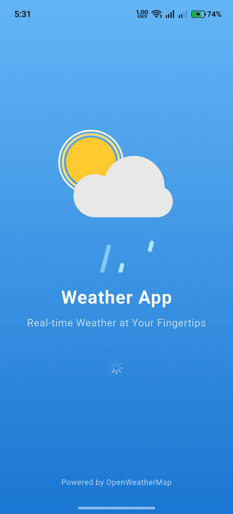
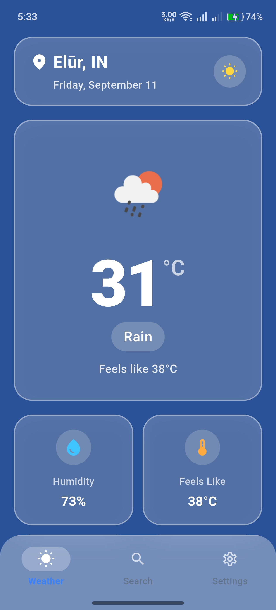
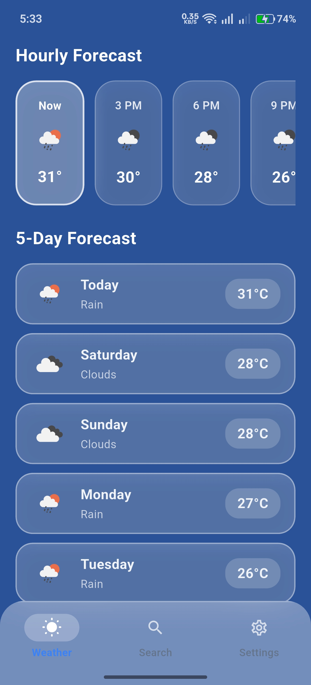

# 🌤️ Weather App

A feature-rich, high-performance Flutter weather application built using **Clean Architecture**, **BLoC Pattern**.

---

## 📱 Screenshots

 
  &nbsp;&nbsp;&nbsp;&nbsp;
  
  &nbsp;&nbsp;&nbsp;&nbsp;
    
  &nbsp;&nbsp;&nbsp;&nbsp;
  

---

## ✨ Features

- 📊 **2x2 Weather Metrics Grid**: Real-time data for **Humidity**, **Feels Like**, **Wind Speed**, and **Condition** with custom icon badges.
- ⏰ **Hourly Forecast & 5-Day Forecast**:
  - Horizontally scrollable frosted glass pills with an active glowing border for the current hour.
  - 5-Day forecast cards displaying day names, weather condition pills, and temperature badges.
- 🔍 **City Search with Quick Recommendation Chips**: Frosted search field with quick suggestion chips (*London, New York, Tokyo, Paris, Sydney, Dubai*).
- ⚙️ **Light & Dark Theme Switch**: Seamless theme toggling via `ThemeCubit`.
- 💾 **Offline Cache & Resilience**: Weather data cached locally with SQLite (`sqflite`) for uninterrupted offline usage.
---

## 🛠️ Tech Stack & Packages

| Package | Purpose |
| :--- | :--- |
| [`flutter_bloc`](https://pub.dev/packages/flutter_bloc) | Predictable State Management |
| [`get_it`](https://pub.dev/packages/get_it) | Service Locator / Dependency Injection |
| [`dio`](https://pub.dev/packages/dio) | HTTP Client for REST API Requests |
| [`geolocator`](https://pub.dev/packages/geolocator) | Device GPS Location Provider |
| [`sqflite`](https://pub.dev/packages/sqflite) | Local SQLite Database for Offline Caching |
| [`lottie`](https://pub.dev/packages/lottie) | Vector Weather Animations |
| [`equatable`](https://pub.dev/packages/equatable) | Value Equality Comparison for BLoC States |
| [`intl`](https://pub.dev/packages/intl) | Date and Time Formatting |

